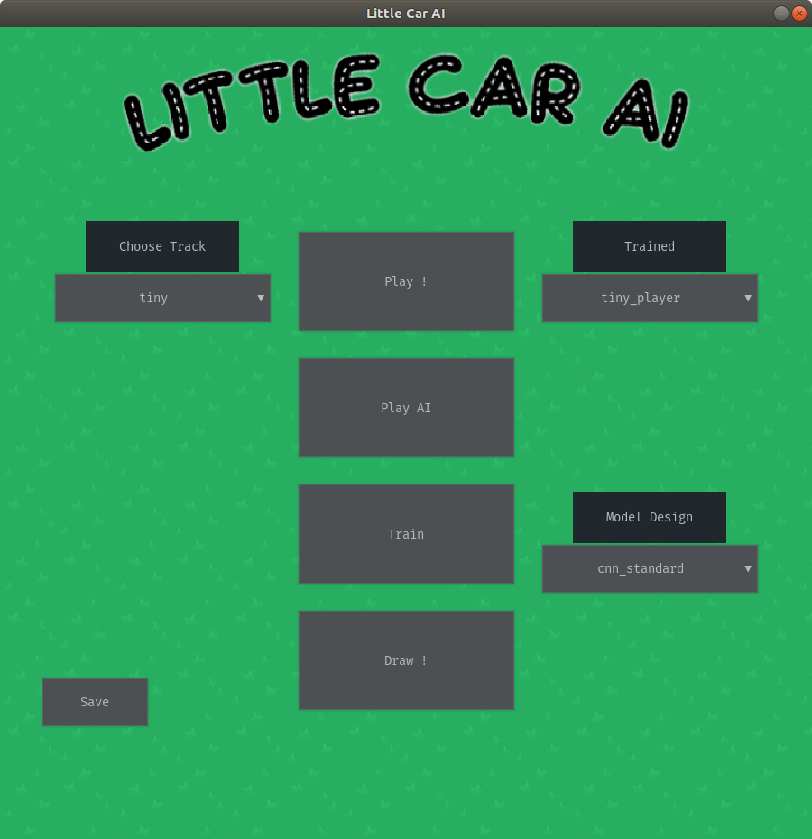
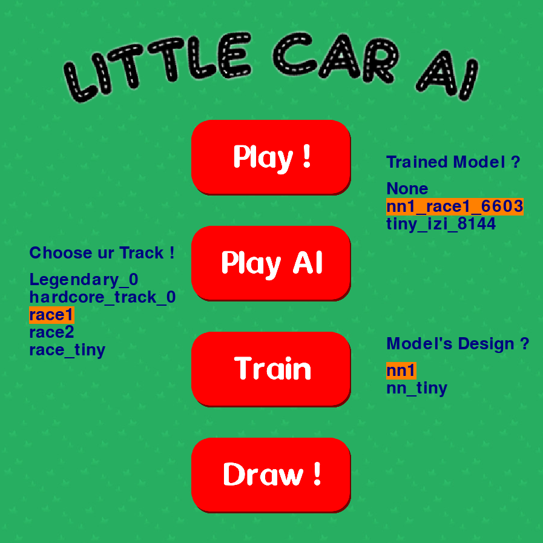
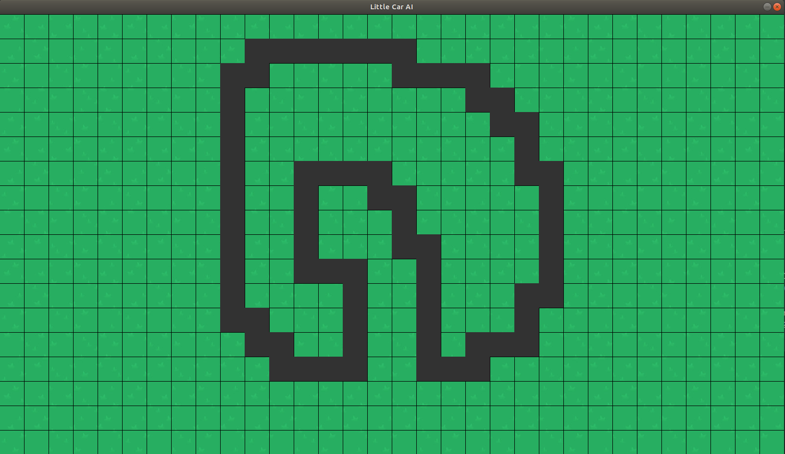
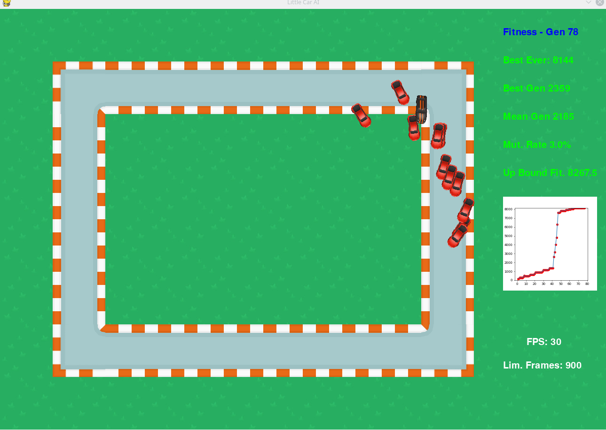
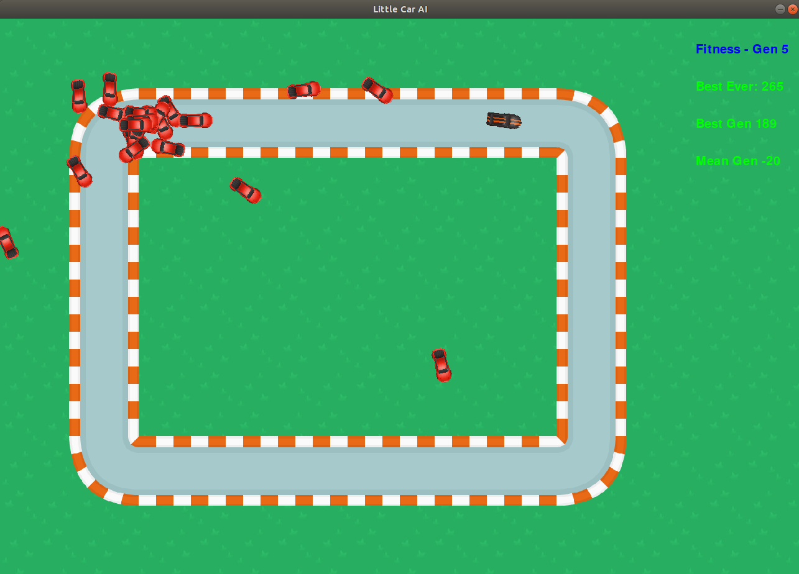
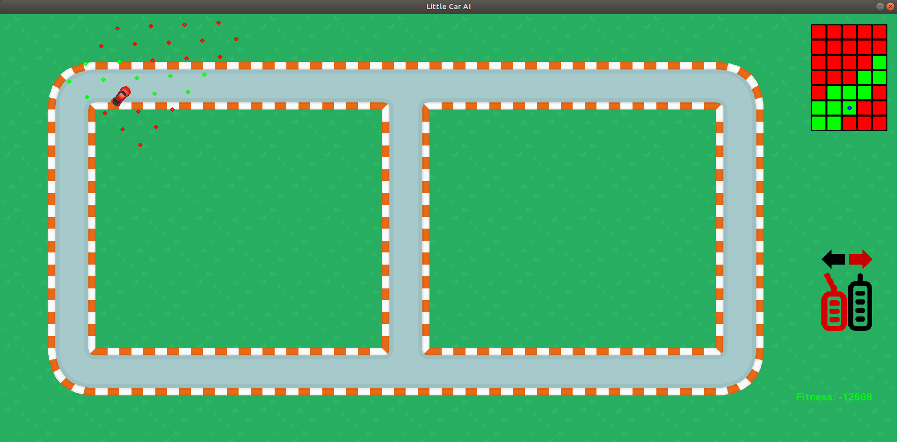
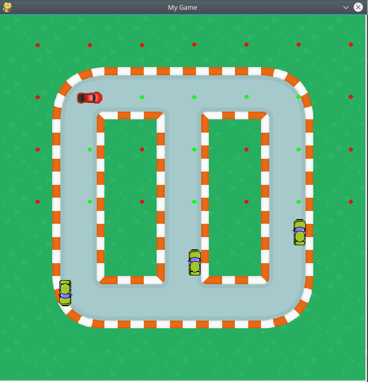

# little-car-ai

Hi, my name is Remi LUX. Currently engineer at Niryo, I code this project during my free time.

The goal to my project is to teach a car to drive through Reinforcement Learning

## How it's work ?

I'm using the method of Genetic Evolution to improve my AI over generations.
1. The Neural Net can access to information from the LIDAR and car's speed.
2. The NN outputs correspond at the command on the wheel (Go straight, turn left,
turn right) and the gas' command (None, Speed Up, Slow Down)
3. At each state, agents receive rewards if they are doing what we want them to do 
(Basically, being on the road and going fast)
4. A certain percentage of agents which received biggest rewards are used
to generate the next generation, thanks to mutation
5. The cycle is repeated

## Evolution, TODO list, Q&A, ...
### TODO LIST
#### Firstly

- [x] Create World
- [x] Create Playable Car
- [x] Add Bots
- [x] Create LIDAR
- [x] Give Control to AI
- [x] Neural Network
- [X] Train on Easy Tracks

#### And Then

- [X] Better
- [ ] Faster
- [ ] Stronger
- [X] Add Menu
- [ ] Q - Learning
- [ ] Multi-threading Processing
- [ ] GPU Processing
- [X] Draw Track from Paper Sheet
- [ ] Test environment with different type of drivers

### Evolution of the Algorithm

| Version | GamePlay Render |
:-------------------------:|:-------------------------:
1.4 | 
1.2 | 
1.1 | 
1.0 | 
0.6 | 
0.3 | 
0.2 | 

### Versions List

- v1.4 : Swap from my custom GUI to pygamegui | 31/10/20
- v1.3 : Clean Code for new adventures | 26/09/20
- v1.2 : Add Menu | 18/07/19
- v1.1 : Add drawing Module | 15/07/19 (I'm Back :D)
- v1.0 : First working version | 02/07/19
- v0.6 : AI & Evolution Algorithm | 30/06/19
- v0.3 : Evolved Playground design | 28/06/19
- v0.2 : First Playground design | 27/06/19

